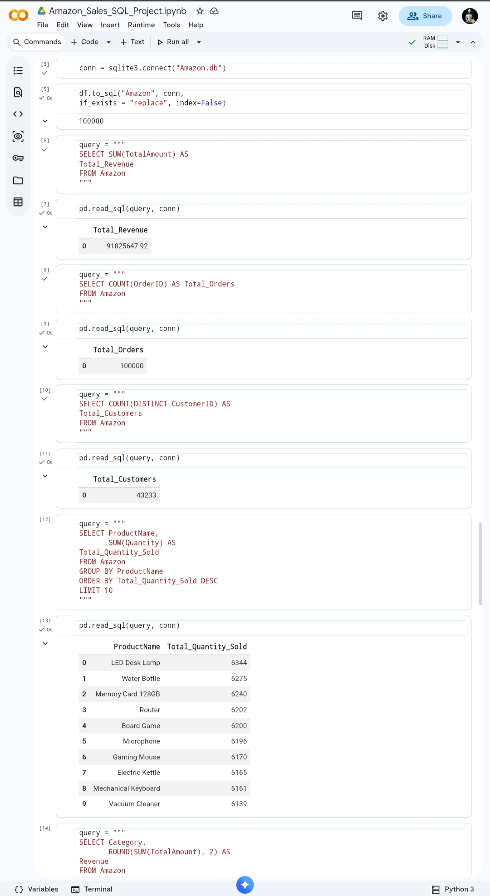
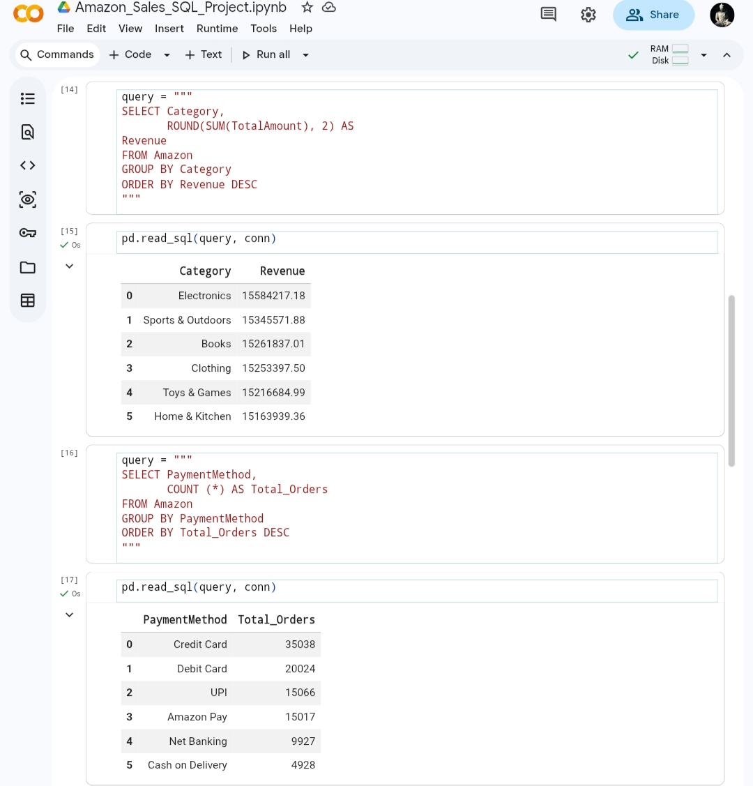
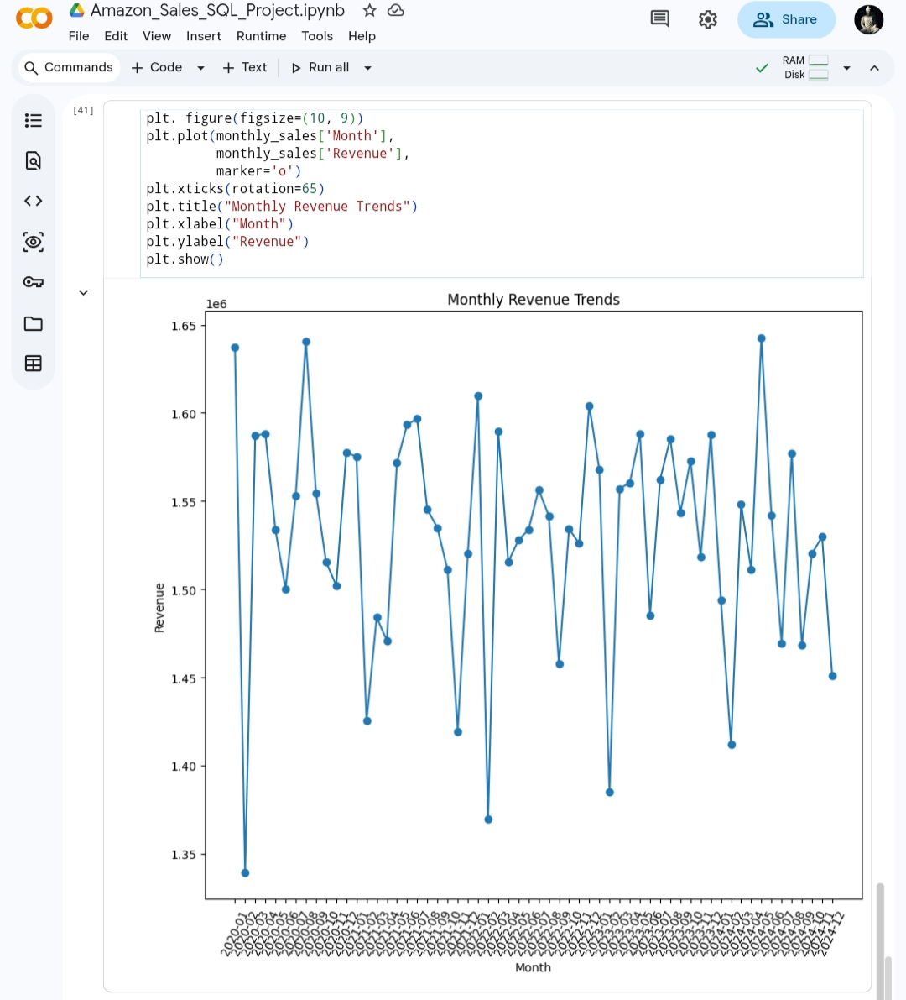
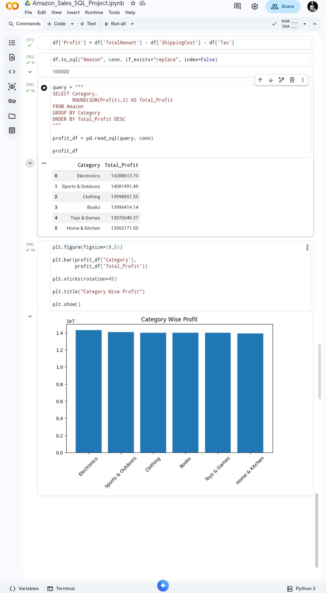

# Amazon Sales Analysis using SQL & Python

## Project Overview
This project analyzes Amazon sales data using SQL, Python, Pandas, and Google Colab.

The analysis focuses on:
- Sales performance
- Customer analysis
- Product performance
- Revenue trends
- Profit analysis
- Payment method insights

## Tools & Technologies
- Python
- SQL
- Pandas
- SQLite
- Matplotlib
- Google Colab

## Dataset Features
The dataset contains:
- Orders
- Customers
- Products
- Categories
- Brands
- Payment Methods
- Revenue
- Tax
- Shipping Cost
- Order Status
- Geographic Data

## Key Analysis Performed
- Total Revenue KPI
- Total Orders KPI
- Customer Analysis
- Top Selling Products
- Category Wise Revenue
- State Wise Revenue
- Monthly Revenue Trend
- Payment Method Analysis
- Profitability Analysis

## Business Insights
- Certain product categories generated higher revenue
- Top customers contributed significantly to sales
- Revenue trends showed seasonal variations
- Online payment methods were highly preferred
- Some categories had lower profitability due to shipping and tax costs

## Project Structure

Amazon-Sales-Analysis/
│
├── Amazon_Sales_SQL_Project.ipynb
├── amazon_sales.csv
├── screenshots/
├── README.md

## Screenshots

### KPI Analysis

### SQL Analysis

### Category Revenue Trend

### Monthly Revenue Trend

### Profit Analysis

## Author
Sanjiv Baviskar
